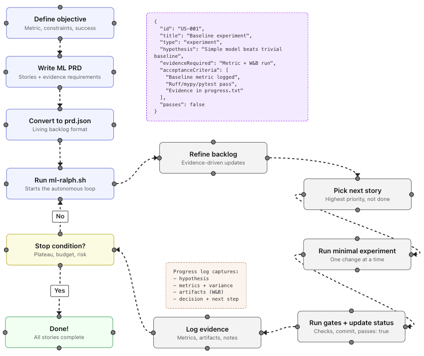

# ML-Ralph


ML-Ralph is an autonomous agent loop for ML projects (Claude or Codex). It keeps the proven Ralph pattern (fresh context per iteration, strict feedback loops) while embedding ML-engineer heuristics, evidence-first iteration, and a dynamic backlog.

Based on [Geoffrey Huntley's Ralph pattern](https://github.com/snarktank/ralph).

## Prerequisites

- [Claude Code](https://docs.anthropic.com/en/docs/claude-code) (`npm install -g @anthropic-ai/claude-code`) **or** [Codex CLI](https://developers.openai.com/codex/cli/) (`npm i -g @openai/codex`)
- `jq` installed (`brew install jq` on macOS)
- A git repository for your ML project

## Setup

### Option 1: Copy into your project

```bash
# From your project root
mkdir -p scripts/ml-ralph
cp /path/to/ml-ralph/ml-ralph.sh scripts/ml-ralph/
cp /path/to/ml-ralph/CLAUDE.md scripts/ml-ralph/CLAUDE.md

chmod +x scripts/ml-ralph/ml-ralph.sh
```

### Option 2: Install skills globally

```bash
cp -r skills/prd ~/.claude/skills/
cp -r skills/ralph ~/.claude/skills/
```

## Workflow

### 1) Create an ML PRD

```
Load the prd skill and create an ML PRD for [your project]
```

The skill writes `tasks/prd-[project].md` with ML-centric stories.

### 2) Convert PRD → prd.json

```
Load the ralph skill and convert tasks/prd-[project].md to prd.json
```

### 3) Run ML-Ralph

```bash
./scripts/ml-ralph/ml-ralph.sh [--tool claude|codex] [max_iterations]
```

ML-Ralph will:

1. Ensure the feature branch from `prd.json.branchName`
2. Refine the backlog if new evidence suggests changes
3. Pick the highest-priority story with `passes: false`
4. Implement a single story
5. Run checks (ruff, mypy, pytest via `uv run`)
6. Commit if checks pass
7. Update `prd.json` to mark the story `passes: true`
8. Append evidence to `progress.txt`
9. Repeat until all stories pass or max iterations reached

When using Codex, ML-Ralph passes `CODEX.md` via stdin and Codex still auto-loads `AGENTS.md` as project instructions.

## Key Files

| File               | Purpose                                      |
| ------------------ | -------------------------------------------- |
| `ml-ralph.sh`      | The ML-Ralph loop runner (Claude-only)       |
| `CLAUDE.md`        | ML-centric agent instructions and heuristics |
| `prd.json`         | Living backlog with story status             |
| `prd.json.example` | Example ML PRD format                        |
| `progress.txt`     | Evidence log and learnings                   |
| `skills/prd/`      | ML PRD generator                             |
| `skills/ralph/`    | PRD → prd.json converter                     |
| `flowchart/`       | Interactive visualization of ML-Ralph        |

## Dynamic PRD (Living Backlog)

`prd.json` is not a static spec. ML-Ralph refines it every iteration based on evidence:

- add/split/reorder stories
- supersede outdated tasks (never delete)
- log the change and reasoning in `progress.txt`

## ML-Engineer Defaults

ML-Ralph encodes:

- scenario understanding before optimization
- data exploration and leakage awareness
- research before reinventing
- baseline-first mindset
- experiment tracking (W&B)
- evidence-first decisions

## Flowchart



The `flowchart/` directory contains the source code. To run locally:

```bash
cd flowchart
npm install
npm run dev
```

## Debugging

```bash
# See which stories are done
cat prd.json | jq '.userStories[] | {id, title, passes}'

# See learnings and evidence
cat progress.txt

# Check git history
git log --oneline -10
```
